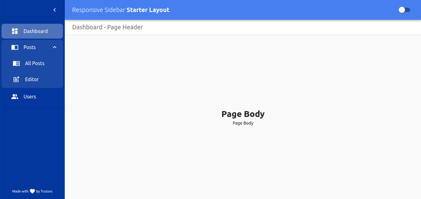
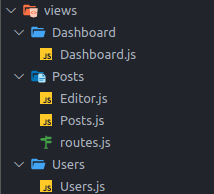

# react-material-sidebar

Basic React responsive sidebar starter template built on top of [Material UI](https://material-ui.com).

Click here for <a href="https://demo.pnath.in" target="_blank">live demo</a>.



## Installation

```
git clone https://github.com/trutoro/react-material-sidebar-starter.git
cd react-material-sidebar-starter
```

Run the packages installation and the server

```
npm install
npm start
```

## Basic customization

### Adding navigation button

Customize navigation button by adding url in `src/data/navigationData.js`, e.g.

```javascript
export const mainNavigation = [
  {
    name: "Dashboard",
    icon: Dashboard,
    url: "/dashboard",
  },
  {
    name: "Posts",
    icon: ImportContacts,
    url: "/posts",
    navigationData: [
      {
        name: "All Posts",
        icon: MenuBook,
        url: "/posts/all",
      },
      {
        name: "Editor",
        icon: PostAdd,
        url: "/posts/editor",
      },
    ],
  },
  {
    name: "Users",
    icon: PeopleAlt,
    url: "/users",
  },
];
```

### Adding navigation routes data

Add the routes path data in `src/data/routesData.js`, by following the folder structure in `src/views` directory, e.g.,



```javascript
export const mainRoutes = [
  {
    path: "/dashboard",
    component: lazy(() => importView(["Dashboard", 2])),
  },
  {
    path: "/posts",
    component: lazy(() => importView("Posts", "routes")),
    routes: [
      {
        path: "/posts/all",
        component: lazy(() => importView("Posts", "Posts")),
      },
      {
        path: "/posts/editor",
        component: lazy(() => importView("Posts", "Editor")),
      },
    ],
  },
  {
    path: "/users",
    component: lazy(() => importView(["Users", 2])),
  },
];
```
